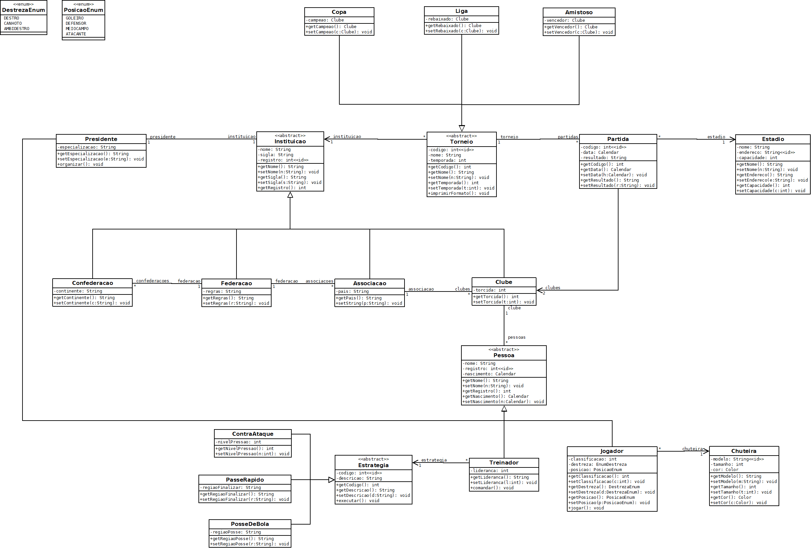

# Futebol-JavaDB
Este projeto consiste em um sistema de gerenciamento de futebol com Java e banco de dados, modelando clubes, torneios e jogadores de forma dinâmica e escalável. Realizou-se o projeto no segundo semestre de 2023 como avaliação da disciplina “Laboratório de Banco de Dados” do curso de Engenharia de Computação da Universidade Federal de Itajubá (UNIFEI - _campus_ Itajubá).

O objetivo do projeto é modelar e gerenciar entidades do universo do futebol, como clubes, jogadores, partidas e torneios. Utiliza conceitos de orientação a objetos e mapeamento objeto-relacional para persistência em banco de dados. Inclui uma interface gráfica que permite a manipulação de jogadores no banco de dados por meio das operações de inserção, alteração e exclusão.

## Tecnologias
* Java – Linguagem principal do projeto
* Banco de Dados Relacional – MySQL (via `persistence.xml`)
* UML - Diagrama de classes utilizado como base de implementação
* JPA (Hibernate) – Para persistência de dados (ORM)
* Swing (Javax.Swing) – Interface gráfica para manipulação de jogadores
* Maven – Gerenciamento de dependências

## Diagrama UML

